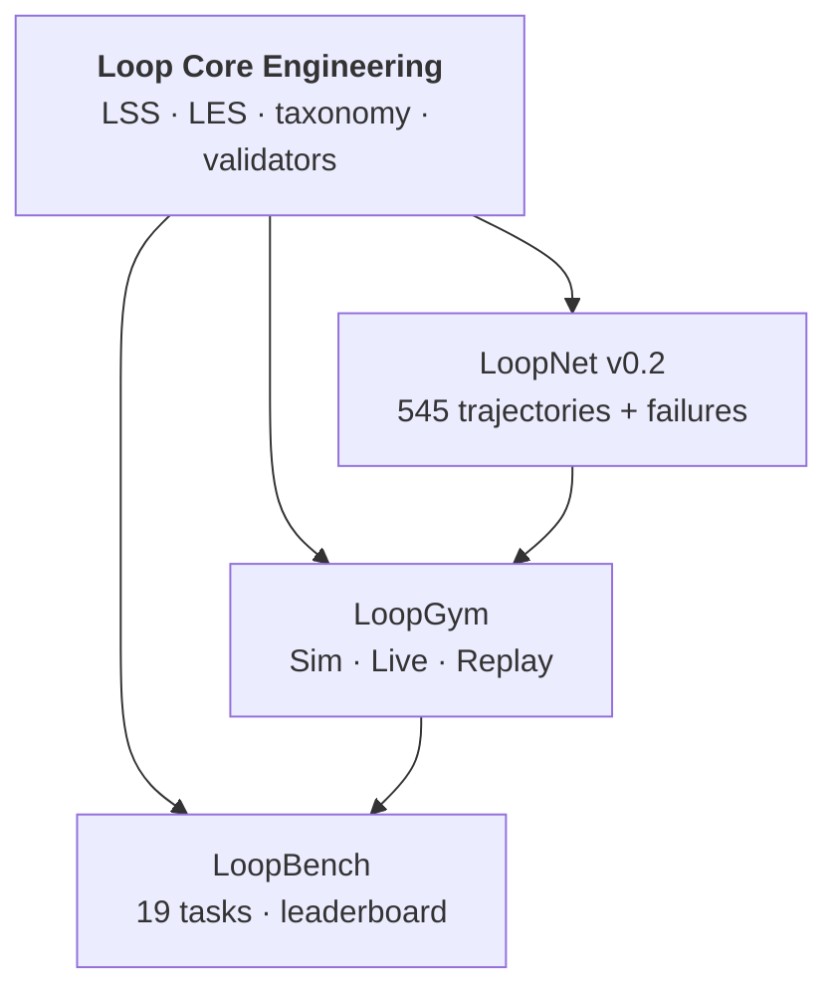

<div align="center">

# Loop Core Engineering

**The specification layer for systems that improve through feedback.**

Machine-readable contracts for declaring loops, scoring them, and naming failures — so every tool in the ecosystem speaks the same language.

<br>

[](https://github.com/KanakMalpani/Loop-Core-Engineering/actions/workflows/validate.yml)
[](LICENSE)
[](https://www.python.org/downloads/)
[](specs/lss-1.1.md)
[](specs/les-1.0.md)

<br>

[**Validate a loop in 30 seconds**](#try-it-now) · [**Read LSS 1.1**](specs/lss-1.1.md) · [**Full stack map**](ECOSYSTEM.md) · [**Discipline docs**](https://github.com/KanakMalpani/Loop-Engineering)

</div>

---

## 🚀 What you get here

| Deliverable | What it does for you |
|-------------|----------------------|
| **[LSS 1.1](specs/lss-1.1.md)** — Loop Specification Standard | Declare objectives, workers, evaluators, memory, safety, and composition blocks in validated YAML |
| **[LES 1.0](specs/les-1.0.md)** — Loop Engineering Score | Compare loops on 8 dimensions: effectiveness, speed, cost, robustness, scalability, safety, adaptability, autonomy |
| **[Failure taxonomy](specs/failure-taxonomy.md)** | Shared `fail.*` codes — not tribal knowledge in Slack threads |
| **[ID registry](specs/loop-ids.md)** | Stable slugs for patterns, env prefixes, and cross-repo references |
| **Validators & LES calculator** | CI-ready tooling every other repo pins — no copied schemas |

This repo is the **root of the dependency graph**. [LoopNet](https://github.com/KanakMalpani/loopnet), [LoopGym](https://github.com/KanakMalpani/LoopGym), and [LoopBench](https://github.com/KanakMalpani/LoopBench) import specs from here. One source. Semver. RFCs.

---

## The specification layer

Pin once — every runtime, dataset, and benchmark imports the same contracts.

<div align="center">
  
</div>

| Artifact | Pin | What you get |
| :--- | :--- | :--- |
| LSS | `lss@1.1.0` | Declarative loops + composition blocks |
| LES | `les@1.0.0` | 8-dimension comparable scores |
| Taxonomy | `fail.*` | Shared failure vocabulary |
| Tools | CI validators | Same check LoopGym and LoopBench run |

---

## ⚡ The problem this solves

Teams building agentic AI hit the same wall: every project invents its own config format, its own metrics, its own vocabulary for "why did the loop fail?"

| Without a shared spec | With Loop Core Engineering |
|-----------------------|----------------------------|
| Incomparable demos | LES-scored, reproducible runs |
| Schema copied into 5 repos | One canonical `lss@1.1.0` pin |
| "It worked in the demo" | Bounded termination + evaluator contracts |
| Failure post-mortems don't transfer | Shared taxonomy across data, runtime, and bench |

Think of it as **HTTP for loops** — a thin, versioned layer that everything else builds on.

---

## ⚙️ The ecosystem



| Repo | Role | Install |
|------|------|---------|
| **Loop Core Engineering** | Specs & governance | Clone + `pip install -r requirements.txt` |
| [LoopNet](https://github.com/KanakMalpani/loopnet) | Dataset | [Hugging Face v0.2](https://huggingface.co/datasets/KanakMalpani/loopnet-v0.2) (recommended) or JSONL |
| [LoopGym](https://github.com/KanakMalpani/LoopGym) | Runtime | `pip install loopgym` |
| [LoopBench](https://github.com/KanakMalpani/LoopBench) | Benchmarks | `pip install loopbench` |

Narrative depth — manifesto, patterns, case studies: [**Loop Engineering**](https://github.com/KanakMalpani/Loop-Engineering)

---

## 🛠️ Try it now

```bash
git clone https://github.com/KanakMalpani/Loop-Core-Engineering.git
cd Loop-Core-Engineering
pip install -r requirements.txt

# Validate against LSS 1.0 (same check CI runs)
python tools/validate_lss.py examples/minimal-loop.yaml

# Structural LES estimate before you run anything expensive
python tools/les_calculator.py --spec examples/minimal-loop.yaml --display
```

**A minimal loop spec looks like this:**

```yaml
loop_name: minimal-echo-loop
version: "1.1"
objective: "Demonstrate smallest valid LSS document"
workers:
  - role: echo
    model: mock
evaluators:
  - type: rubric
termination_conditions:
  - type: max_iterations
    value: 3
```

Three [CI-validated examples](examples/) ship with the repo — from smoke test to multi-agent debate.

---

## 📋 Specifications `@1.1.0`

| Artifact | Pin | Document |
|----------|-----|----------|
| LSS JSON Schema | `lss@1.1.0` | [`specs/lss-1.1.schema.json`](specs/lss-1.1.schema.json) |
| LSS overview | — | [`specs/lss-1.1.md`](specs/lss-1.1.md) |
| LES formulas | `les@1.0.0` | [`specs/les-1.0.md`](specs/les-1.0.md) |
| Pattern & env IDs | — | [`specs/loop-ids.md`](specs/loop-ids.md) |
| Semver policy | — | [`CHANGELOG.md`](CHANGELOG.md) |

**LES scale:** store and exchange in **`[0, 1]`**. Multiply by 100 only for display.

---

## 🎯 Who this is for

| You are… | Start here |
|----------|------------|
| **Building an agent framework** | Pin LSS — let users export portable loop specs |
| **Running benchmarks** | Validate submissions against [`lss-1.1.schema.json`](specs/lss-1.1.schema.json) |
| **Publishing research** | Cite `lss@1.1.0` + `les@1.0.0` for reproducibility |
| **Designing org workflows** | Use failure taxonomy + LES dimensions as a shared scorecard |

---

## 🏛️ Governance

Spec changes flow through **[RFCs](templates/rfc-template.md)** → review → semver bump in [`CHANGELOG.md`](CHANGELOG.md). See [CONTRIBUTING.md](CONTRIBUTING.md) · [SYNC.md](SYNC.md) · [SECURITY.md](SECURITY.md)

---

## 🤝 Adoption

Reproduce the stack in 60 minutes: [REPRODUCE.md](https://github.com/KanakMalpani/Loop-Engineering/blob/main/contributions/REPRODUCE.md) · [Discussion #10](https://github.com/KanakMalpani/Loop-Engineering/discussions/10)

---

## 📝 Citation

```bibtex
@misc{loop-core-engineering-2026,
  title={Loop Core Engineering: Canonical LSS and LES Specifications},
  author={Malpani, Kanak},
  year={2026},
  url={https://github.com/KanakMalpani/Loop-Core-Engineering}
}
```

<div align="center">

<sub>MIT License · v0.1 · <a href="STATUS.md">Status</a></sub>

</div>
