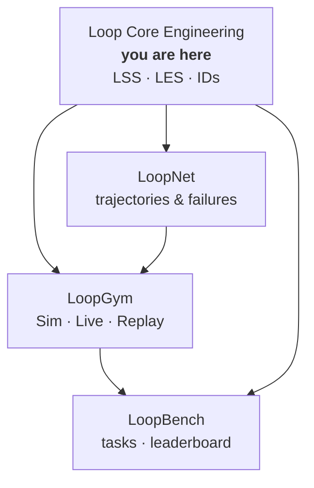

<p align="center">
  <strong>Loop Core Engineering</strong><br>
  <em>The specification layer for self-improving systems.</em>
</p>

<p align="center">
  <a href="https://github.com/KanakMalpani/Loop-Core-Engineering/actions/workflows/validate.yml"></a>
  <a href="LICENSE"></a>
  
  <a href="specs/lss-1.0.schema.json"></a>
  <a href="specs/les-1.0.md"></a>
</p>

---

> **Prompt engineering** optimizes a single turn.  
> **Agent engineering** optimizes autonomous actors.  
> **Loop engineering** optimizes systems that *improve through feedback* — and this repo is where that discipline becomes **machine-readable law**.

**Loop Core Engineering** is the canonical source for:

- **LSS** — Loop Specification Standard: how to declare objectives, workers, evaluators, memory, safety, and termination in YAML
- **LES** — Loop Engineering Score: an eight-category composite for comparing loops on effectiveness, speed, cost, robustness, and more
- **ID registry** — stable slugs for patterns, failure modes, and environment prefixes across the ecosystem

Every other Loop Engineering repo **pins specs from here**. No forked schemas. No silent drift.

<p align="center">
  <a href="#-60-second-start"><strong>Get started →</strong></a> ·
  <a href="ECOSYSTEM.md">Full stack map</a> ·
  <a href="specs/lss-1.0.md">Read LSS 1.0</a>
</p>

---

## Why this exists

AI systems are moving from one-shot prompts to **closed-loop execution**: observe → act → evaluate → update → repeat. Without a shared spec, every team reinvents its own YAML, metrics, and failure vocabulary.

Loop Core Engineering is the **HTTP of loops** — a small, versioned contract that tools, datasets, runtimes, and benchmarks can depend on.

| Without LSS | With LSS |
|-------------|----------|
| Ad-hoc agent configs | Validated, bounded loop documents |
| Incomparable demos | LES-scored, reproducible runs |
| Tribal failure knowledge | Shared `fail.*` taxonomy |
| Schema copied into 5 repos | One canonical semver source |

---

## The stack



| Repository | Role |
|------------|------|
| **[Loop Core Engineering](https://github.com/KanakMalpani/Loop-Core-Engineering)** | Specs, validators, RFC process |
| **[LoopNet](https://github.com/KanakMalpani/loopnet)** | Dataset — the ImageNet of loops |
| **[LoopGym](https://github.com/KanakMalpani/LoopGym)** | Runtime — Gym for LSS-defined loops |
| **[LoopBench](https://github.com/KanakMalpani/LoopBench)** | Benchmarks — MLPerf for loops |

Narrative docs (manifesto, patterns, case studies): [Loop Engineering discipline repo](https://github.com/KanakMalpani/Loop-Engineering).

---

## ⚡ 60-second start

```bash
git clone https://github.com/KanakMalpani/Loop-Core-Engineering.git
cd Loop-Core-Engineering
pip install -r requirements.txt

# Validate a loop spec against LSS 1.0
python tools/validate_lss.py examples/minimal-loop.yaml

# Validate all shipped examples (same check CI runs)
python tools/validate_all_examples.py

# Design-time LES estimate from structure
python tools/les_calculator.py --spec examples/minimal-loop.yaml --display
```

On Windows: `py -3.12` instead of `python` if needed.

---

## Specifications `@1.0.0`

| Artifact | Pin | Document |
|----------|-----|----------|
| LSS JSON Schema | `lss@1.0.0` | [`specs/lss-1.0.schema.json`](specs/lss-1.0.schema.json) |
| LSS overview | — | [`specs/lss-1.0.md`](specs/lss-1.0.md) |
| LES formulas | `les@1.0.0` | [`specs/les-1.0.md`](specs/les-1.0.md) |
| Pattern & env IDs | — | [`specs/loop-ids.md`](specs/loop-ids.md) |
| Failure taxonomy | — | [`specs/failure-taxonomy.md`](specs/failure-taxonomy.md) |
| Semver policy | — | [`CHANGELOG.md`](CHANGELOG.md) |

**LES scale:** store and exchange scores in **`[0, 1]`**. Multiply by 100 only for human-facing reports.

---

## Example loops (CI-validated)

| Example | Pattern | What it demonstrates |
|---------|---------|----------------------|
| [`minimal-loop.yaml`](examples/minimal-loop.yaml) | Echo / smoke | Smallest valid LSS document |
| [`research-loop.yaml`](examples/research-loop.yaml) | Research loop | Multi-step synthesis with rubric |
| [`multi-agent-loop.yaml`](examples/multi-agent-loop.yaml) | Multi-agent | Role-separated workers + evaluator |

---

## Tooling

| Command | Purpose |
|---------|---------|
| `python tools/validate_lss.py <file.yaml>` | Validate one spec |
| `python tools/validate_all_examples.py` | CI entrypoint |
| `python tools/les_calculator.py --spec … --display` | Structural LES estimate |

---

## Governance

Spec changes flow through **[RFCs](templates/rfc-template.md)** → review → semver bump in [`CHANGELOG.md`](CHANGELOG.md). See [CONTRIBUTING.md](CONTRIBUTING.md) and [SYNC.md](SYNC.md).

---

## Citation

```bibtex
@misc{loop-core-engineering-2026,
  title={Loop Core Engineering: Canonical LSS and LES Specifications},
  author={Malpani, Kanak},
  year={2026},
  url={https://github.com/KanakMalpani/Loop-Core-Engineering}
}
```

---

<p align="center">
  <sub>MIT License · v0.1 shipped · <a href="STATUS.md">Status</a> · <a href="SECURITY.md">Security</a></sub>
</p>
